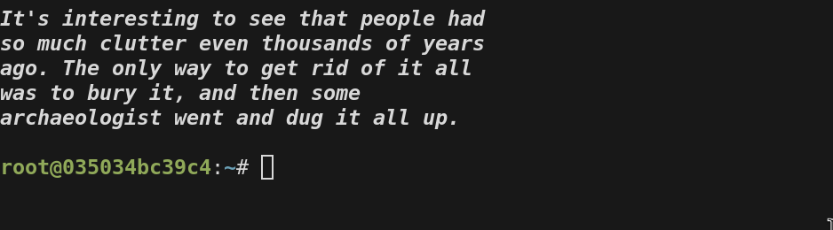

# Pilkington API
API that returns quotes by Karl Pilkington in JSON format

A random quote can be accessed from http://172.232.159.222/random

All quotes can be accessed from http://172.232.159.222/all

## Example
By adding the following lines to your `.bashrc` your terminal will print a Karl Pilkington quote everytime it is opened
```bash
PILKINGTON_QUOTE=$(curl -s http://172.232.159.222/random | jq -r '.quote' | fold -s -w 40 )
echo -e "\n\e[3m\e[1m$PILKINGTON_QUOTE\e[0m\n"
```

